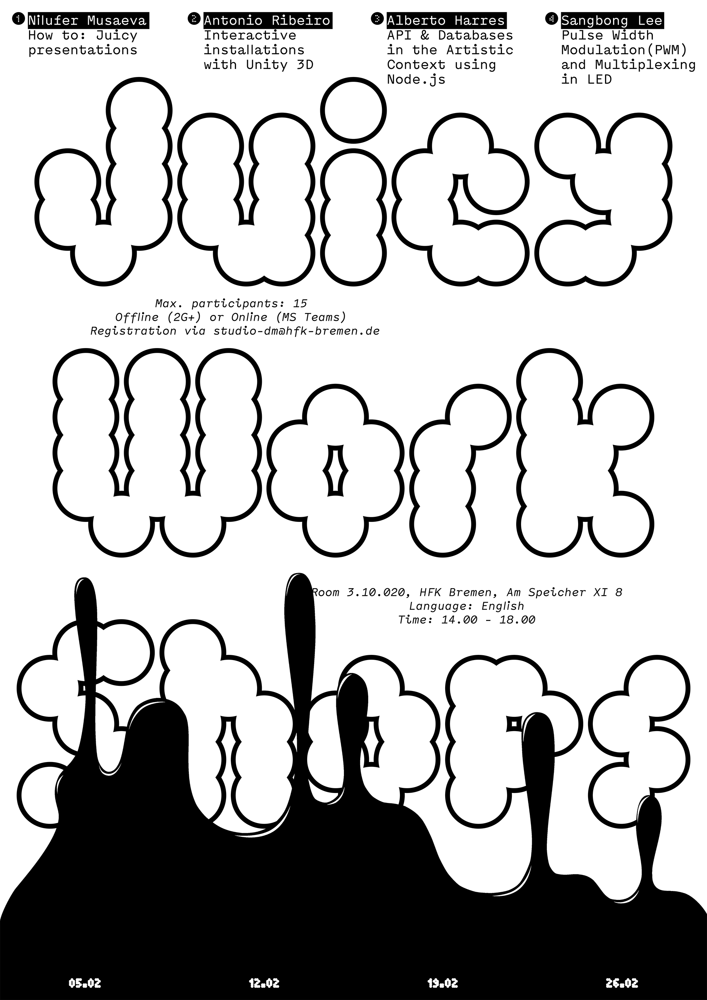

# Digital Media Juicy Workshops

The Digital Media Studio kindly offers a sequence of 4 *Juicy Workshops* ministred by digital media master students.

## Workshops

### 05.02: How to: juicy presentations, by Nilya Musaeva

Have you ever thought about making your presentations not only using google slides and Roboto Mono font? Have you ever wondered which font would fit another one the best, how to make this and that glossy logo effect, how to keep audience’s attention throughout your project proposal? I, Nilya, have made more than 50 presentations for every occasion possible during my bachelors. And am still doing it. Come and let’s exchange our PWW (Presentation Wizards Wisdom). Don’t forget to make a little Pinterest/Are.na moodboard ;)

### 12.02: Interactive installations with Unity 3d, by Antonio Ribeiro

In this workshop, we will go through the basics of Unity and use it to create an interactive installation project together. As a game engine Unity can be very powerful for media artists who want to develop complex and computationally intensive projects.

### 19.02: API & Databases in the Artistical Context using Node.js, by Alberto Harres

In this workshop the participants will be guided through the creation of a simple project where data can be stored and retrived in an online database, with the goal of making possible collaborative practices for artistical projects. Beyond the practical, we will also hint on some theoretical notions in terms of archivism, memory and care.

basic knowledge of programming preferred but not required.  

### 26.02: Pulse Width Modulation(PWM) and Multiplexing in LED, by Sangbong Lee

The participants will be guided on the basic principles of PWM control with Arduino and TLC5940 chip; multiplex techniques for single color LED to expand PWM channel as well as how to read the datasheet for electronic components.

## Infos

- __Language__: English

- __Where__: Room 2.11.100 @ HfK Bremen - Am Speicher XI

- __Time__: Starting 14:00h until around 18:00h.

- __Hybrid mode__: When possible, participants will be able to follow online on MS Teams.

- __2G+__: for those in presence, either tested or boosted.

- __Max Participants__: 15 per workshop.

- __Inscription__: send email to at [studio-dm@hfk-bremen.de](studio-dm@hfk-bremen.de)
