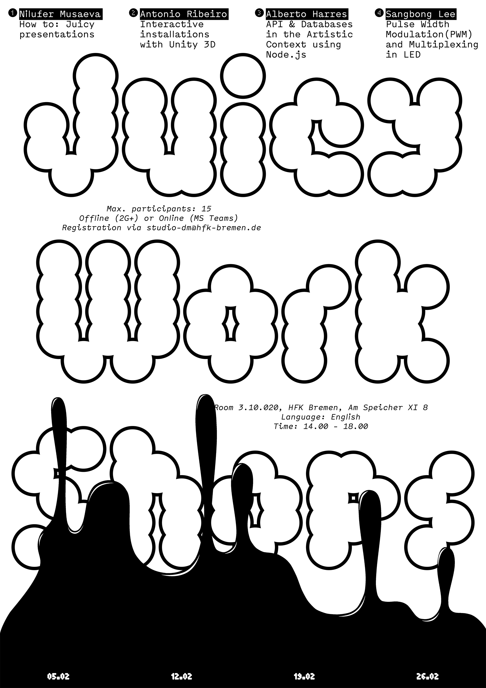

*(poster by Liudmila Savelyeva)*

# Digital Media Juicy Workshops

A series of peer-to-peer, student-led workshops—by students for students—where Digital Media students from HfK and Uni share skills, experiment, and practice giving workshops.

---

The Juicy Workshops usually take place in late November or December, with planning and the open call happening between September and October. This can shift if Hochschultage moves back to winter. Organizers create and circulate an open call for workshop proposals, select around three to five workshops, and choose the dates. We have tried both one- and two-day formats, usually on weekends so classes don’t clash.

The organizing team handles the call for proposals, communication with both HfK and Uni students, selection of workshops, and scheduling of rooms. They also coordinate payments and material costs. Students are paid for both organizing and workshop hours; the amount is modest and depends on the final budget. Support for equipment or additional material can be discussed with STUKO if needed. Knowledge and files—posters, program, budget—should be passed on to the next group of organizers.

---

### Budget

GbA usually provides a total budget of about **€1,500–2,000**.
Approximate split:

* around **€1,200** for student working hours
* up to **€500** for materials (this can be lower or partly covered by STUKO)

Forms for payment and reimbursement:

* [Abrechnung für Dienstleistungen / Aufwandsentschädigungen](https://portal.hfk-bremen.de/startseite/docs/formulare/Allgemein/Abrechnung%20f%C3%BCr%20Dienstleistungen%20Aufwandsentsch%C3%A4digungen%20ab%2001.02.2025.pdf)
* [Antrag auf Auslagenerstattung](https://portal.hfk-bremen.de/startseite/docs/formulare/Allgemein/Antrag%20auf%20Auslagenerstattung.pdf)

All completed forms go to **Prof. Peter von Maydell**.
Students need a **Steuernummer** (tax number) for payment, so facilitators without one should apply early.

#### Budget example:

| Item / Workshop                        | Hours / Participants | Hourly Rate (€) | Cost (€) | Total (€) |
|-----------------------------------------|----------------------|-----------------|---------:|---------:|
| **Organization / Planning**             | 16                  | 12              | 192     | **192** |
| **Design Posters**                       | 8                   | 12              | 96      | **96** |
| **Poster Printing**                       | –                   | –               | 24      | **24** |
| **Documentation Workshop** |                      |                 |         |         |
| • Lecture preparation time               | 16                  | 12              | 192     |         |
| • Lecture time                            | 8                   | 12              | 96      |         |
| • Materials (cost per person) (≈15 ppl)   | 15                 | 0               | 182     | **470** |
| **Eletronic Workshop**         |                      |                 |         |         |
| • Lecture preparation time               | 16                  | 12              | 192     |         |
| • Lecture time                            | 8                   | 12              | 96      |         |
| • Materials (cost per person) (≈14 ppl)   | 15                 | 14              | 260.51  | **548.51** |
| **AI Workshop**             |                      |                 |         |         |
| • Lecture preparation time               | 16                  | 12              | 192     |         |
| • Lecture time                            | 8                   | 12              | 96      | **288** |
| **TouchDesigner Workshop**     |                      |                 |         |         |
| • Lecture preparation time               | 16                  | 12              | 192     |         |
| • Lecture time                            | 8                   | 12              | 96      | **288** |
| **Grand Total**                          |                      |                 |         | **1,906.51** |

---

Workshops are usually limited to 12–15 participants. Registration can stay simple, for example by email to [studio-dm@hfk-bremen.de](mailto:studio-dm@hfk-bremen.de). Rotate the main organizers each year to keep it sustainable and make sure to archive everything for the next team.

Contact for budget and general support: **Prof. Peter von Maydell** ([peter.vonmaydell@hfk-bremen.de](mailto:peter.vonmaydell@hfk-bremen.de)).

---

### Links

- [Proposals for Juicy Workshops 2024 supported by Digital Media Uni + HfK Bremen](https://forms.office.com/Pages/ResponsePage.aspx?id=72nnCfA49Eyp4hlMzNJHYUdBgION1GhJgHNRiWOAz-pUQkg4RldCTlc0MVBXOUlWSExVUUhOMlQ2VS4u)
- [Digital Media Workshops 2022](https://forms.office.com/Pages/ResponsePage.aspx?id=72nnCfA49Eyp4hlMzNJHYeXNxqdY5w9BhVBAIS4p029UQkxVRVFDMUZYSjlXOFpKQkw5NTFMWlVXQi4u)
- [Digital Media Workshops 2023](https://forms.office.com/Pages/ResponsePage.aspx?id=72nnCfA49Eyp4hlMzNJHYUdBgION1GhJgHNRiWOAz-pUN0RGNU1QME0xSTRUQUtTUklTVVpOTjM1TS4u)

