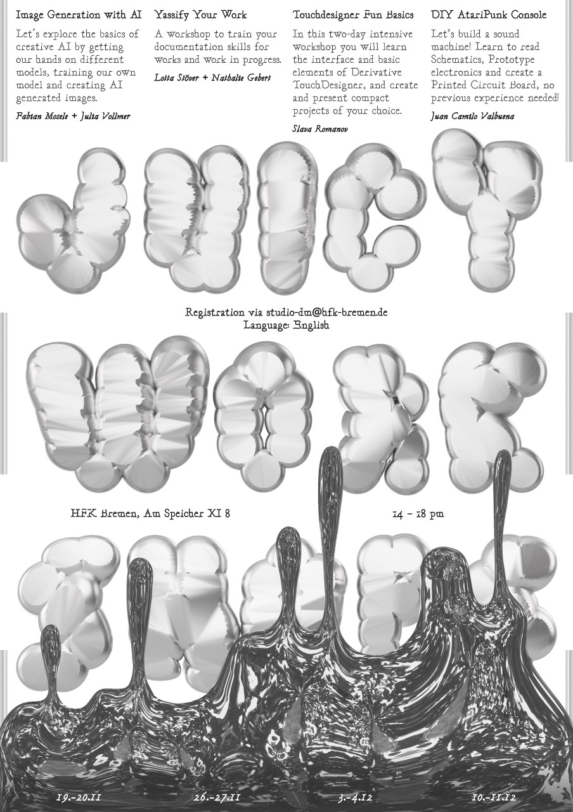

# Digital Media Juicy Workshops 2.0 (2022)

The **Digital Media Juicy Workshops 2.0** offered a sequence of four **two-day** peer-to-peer workshops in November and December 2022, organized and led by Digital Media students.  
Workshops took place on Saturdays and Sundays, 14:00–18:00, at **HfK Bremen, Speicher XI** (room announced the week before each session).  
Language: **English** · Maximum participants per workshop: **15**  
Open to all Bachelor, Master, Uni, and HfK students.

---

## Program

### 19–20 November  
**Image Generation with AI** — *Fabian Mosele & Julia Vollmer*  
Introduction to image-generative machine learning models (GANs vs Diffusion), their history, and ethical debates. Participants trained their own models and created AI-generated images.  
**Requirements:** Laptop; Google Drive with at least 6 GB free (multiple accounts helpful); basic programming knowledge useful.

---

### 26–27 November  
**Yassify Your Work** — *Lotta Stöver & Nathalie Gebert*  
Workshop on documenting artworks for online presentation. Covered documentation styles, making documentation videos, post-processing (including white balance), and building a portable DIY lighting kit.  
**Requirements:** Object to document; video/photo editing software; camera or smartphone camera; tripod.

---

### 03–04 December  
**TouchDesigner Fun Basics** — *Slava Romanov*  
Introduction to visual programming with TouchDesigner. Participants learned the interface, core elements, and created compact generative projects.  
**Requirements:** Laptop (Windows or Mac, ≥8 GB RAM, discrete graphics recommended); TouchDesigner 2022/26590 or newer (free version acceptable).

---

### 10–11 December  
**DIY AtariPunk Console** — *Juan Camilo Valbuena*  
Hands-on electronics project building a sound oscillator using two 555 timers. Covered schematic reading, sound-wave basics, circuit prototyping, PCB design, soldering, and enclosure design.  
**Requirements:** No prior knowledge required.

---

## Registration

Participants registered by emailing **studio-dm@hfk-bremen.de** with their desired workshop.

---

## Team

- **Organizers:** Julia Vollmer, Alberto Harres  
- **Poster Design:** Lucy Savelyeva  
- **Updates:** [https://github.com/digitalmediabremen/juicy-workshops-v2](https://github.com/digitalmediabremen/juicy-workshops-v2)  

For questions:  
- studio-dm@hfk-bremen.de  
- aharres@hfk-bremen.de  
- jvollmer@hfk-bremen.de