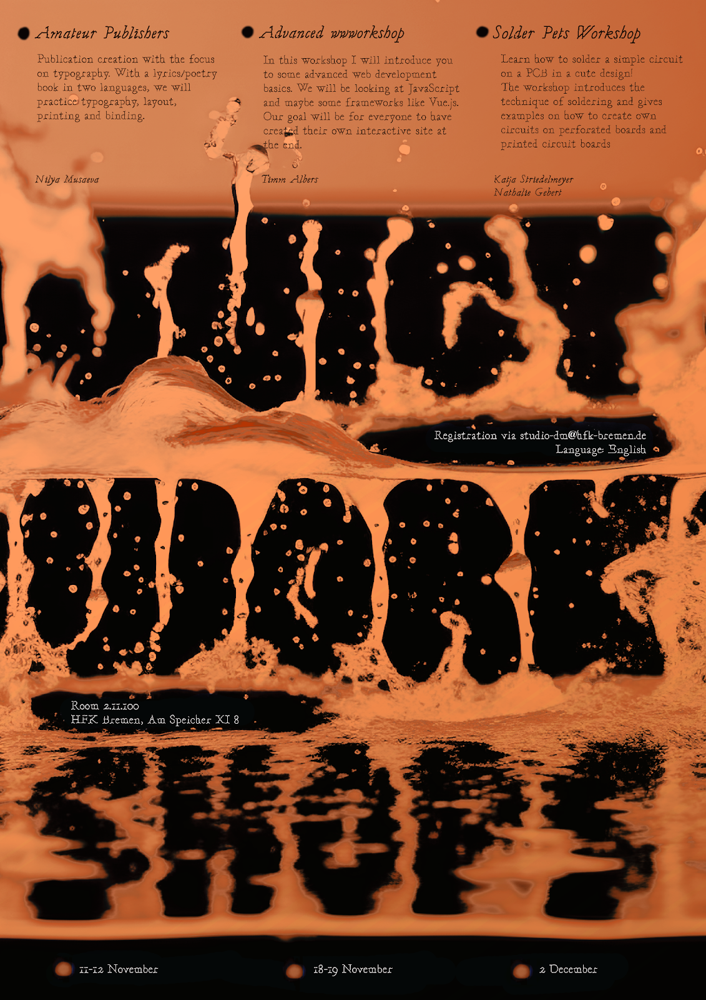

# Digital Media Juicy Workshops 2023

The **Digital Media Juicy Workshops 2023** offered a series of peer-to-peer sessions organized by students for students.  
Open to all Digital Media students from HfK and Uni Bremen.

---

## Program

### Amateur Publishers  
**Facilitator:** Nilya Musaeva  
**Dates:** 11–12 November 2023  
Create a bilingual lyrics/poetry book while exploring typography, layout, printing, and binding.  
*Preparation:* Bring text and images or drawings you would like to include.

---

### Advanced WWWorkshop  
**Facilitator:** Timm Albers  
**Dates:** 18–19 November 2023  
Introduction to advanced web development basics with JavaScript and possibly frameworks like Vue.js.  
Goal: build an interactive site by the end of the workshop.  
*Requirements:* Laptop; basic HTML/CSS knowledge helpful but not required.

---

### Solder Pets  
**Facilitators:** Katja Striedelmeyer & Nathalie Gebert  
**Date:** 2 December 2023  
Learn to solder a simple circuit on a PCB in a custom design. Includes techniques for creating circuits on perforated and printed circuit boards.

---

## Details

- **Language:** English  
- **Location:** Room 2.11.100, HfK Bremen, Speicher XI  
- **Time:** 14:00–18:00  
- **Participants:** Limited to 12–20 per workshop  
- **Registration:** Reply to the announcement email with the workshop you wish to attend.  
- Detailed information was sent to registered participants one week before each workshop.

---

## Organizers

- **Main Organizers:** Vanessa Ehmann & Fabian Mosele  
- **Studio Speakers:** Clemens & Vanessa  
- **Contact:**  
  - studio-dm@hfk-bremen.de  
  - vehmann@hfk-bremen.de  
  - fmosele@hfk-bremen.de  
  - Studio Digitale Medien phone: 0421 9595-1304 (3.09.060) / -1305 (3.09.100) / (3.09.020)
