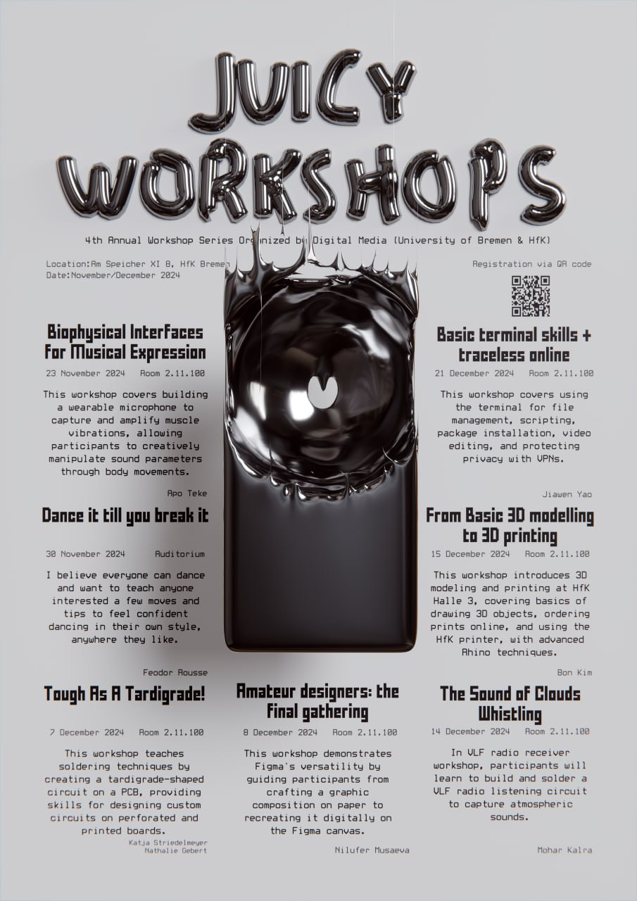

*(poster by Ayşen Kocakabak)* 

# Digital Media Juicy Workshops 2024

The **Digital Media Juicy Workshops 2024** present a series of peer-to-peer, student-led sessions where Digital Media students from HfK and Uni Bremen share skills, experiment, and practice giving workshops.  
Registrations are open for all workshops.

---

## Program & Dates

All workshops begin at **11:00** and run for approximately **5–6 hours**.  
Location: **Room 2.11.100, Speicher XI, HfK Bremen**  
*(except where noted)*

| Date        | Workshop Title                                                           | Facilitator(s)                              | Notes                          |
|-------------|---------------------------------------------------------------------------|----------------------------------------------|---------------------------------|
| **Sat 23 Nov** | *Biophysical Interfaces for Musical Expression*                        | Apo Teke                                     |                                 |
| **Sat 30 Nov** | *Dance It Till You Break It*                                           | Feodor Rousse                                | **Auditorium**, Speicher XI     |
| **Sat 07 Dec** | *Tough as a Tardigrade!*                                               | Katja Striedelmeyer & Nathalie Gebert        |                                 |
| **Sun 08 Dec** | *Amateur Designers: The Final Gathering*                               | Nilya Musaeva                                |                                 |
| **Sat 14 Dec** | *The Sound of Clouds Whistling: VLF Radio Receiver Workshop*           | Mohar Kalra                                  |                                 |
| **Sun 15 Dec** | *From Basic 3D Modeling to 3D Printing*                                | Bon Kim                                      |                                 |
| **Sat 21 Dec** | *Ancient Prompting: Terminal Skills + Traceless Online*                | Jiawen Yao                                   |                                 |

---

## Registration

- Register by **Wednesday** of the week of the desired workshop.  
- Confirmations and waiting lists are sent by **Thursday** of that week.  
- Participants may register for multiple workshops, but are asked to sign up only for sessions they intend to attend.

**Registration form:** [https://forms.office.com/e/289QkFfxpy](https://forms.office.com/e/289QkFfxpy)

---

## Contact

For questions or further information:

- **Apo Teke:** ateke@hfk-bremen.de  
- **Ayşen Kocakabak:** akocakabak@hfk-bremen.de  

---

**Organizers:** Juicy Workshops 4.0 Team – Apo Teke, Ayşen Kocakabak, Gogol
